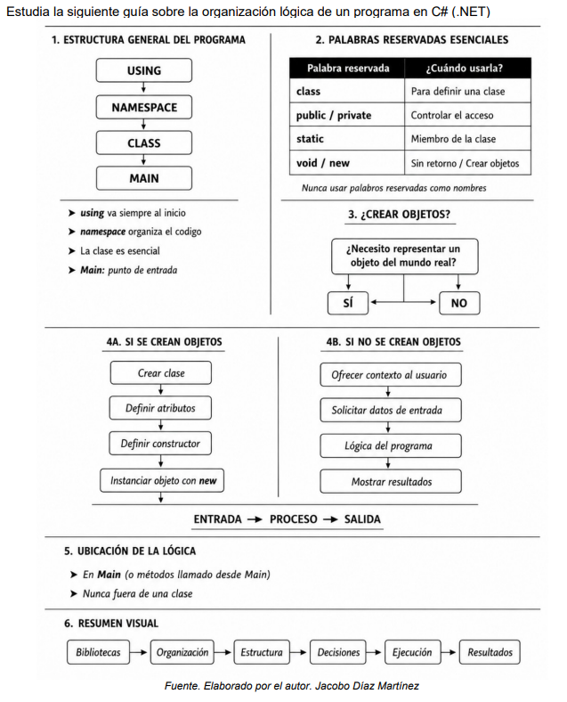

# netApp01

<h1>Caso de estudio Actividad 3. Resolver problemas con C#</h1>

 

Usando la guía, programa el código que resuelve el siguiente problema

Representar a un Estudiante Universitario

## :hammer: El programa debe solicitar los siguientes datos de un estudiante:

- `Nombre completo (iniciando por nombre, después apellido paterno y apellido materno).`
- `Año de nacimiento.`
- `Carrera que estudia.`
- `Promedio general.`
- `Número de materias inscritas.`

## Calcular y mostrar:

- `La edad actual del estudiante.`
- `La cantidad total de horas de estudio semanales, considerando que dedica 4 horas por semana a cada materia.`

## Mostrar toda la información capturada en pantalla
- `El nombre iniciando por apellido paterno, después apellido materno y nombre al final.`
- `La edad calculada.`
- `Las horas de estudio semanales.`

## Programado por

| [ Alberto Balderas](https://github.com/Basahart) |  
| :---: |
